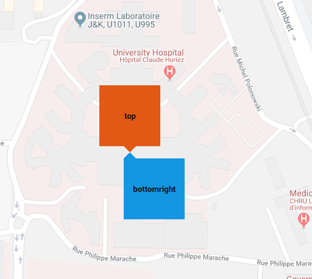

# vue2-gmap-custom-marker

This component allows you to display custom HTML content on the map using Overlay.
This component is an adaptation of the Google Map V3 overlay code sample with some great ideas from [angularjs google map](https://ngmap.github.io/) from this [component](https://github.com/allenhwkim/angularjs-google-maps/blob/master/directives/custom-marker.js).

## /!\ important note

This project is originally a plugin for [vue-google-maps](https://github.com/xkjyeah/vue-google-maps).
Now this project seems no more maintained and a maintained [fork](https://github.com/diegoazh/gmap-vue) has started, As this is a fork, this plugin should work on it seeminglessly. The demo for this project started using this project on 2020-11-10.
read [this](https://github.com/xkjyeah/vue-google-maps#attention) for more information about this.

You might force the 5.6.2 version in your package.json for this plugin to keep compatibility until you want to switch to gmap-vue.

For those that use clusters with this plugin, the new release might break things. For this plugin website demo, I had to create [this folder](https://github.com/eregnier/vue2-gmap-custom-marker-demo/tree/master/public/images) that contains clusters images the clusters uses in vue-gmap. In case you have troubles with this, just create the same folder with the images from the link above in public foler of your vue project (or served in `/images/m1.png` for exemples depending on you webserver configuration.)

## Demo

[Demo](https://vue2-gmap-custom-marker-demo.utopland.net/)

You might look at this [demo code repository](https://github.com/eregnier/vue2-gmap-custom-marker-demo) for features usage and complete exemple around this plugin.

## Features

* Display reactive custom html into markers on google map using slot system

* Live property change allows simple interaction with coordonates and zindex of html marker element

* Google map clustering support (see demo for exemple)

* Simple positionning system for marker around the origin point

* Specific markers offset X and Y for more control about html element display

* Almost all API of the component is optional, just start with lon, lat property

* Work (around) with nuxt with [this trick](https://github.com/eregnier/vue2-gmap-custom-marker/issues/15#issuecomment-544203425)

## Example


## Installation

Install the package from [npm](https://www.npmjs.com/package/@busability/vue2-gmap-custom-marker):

`npm i @busability/vue2-gmap-custom-marker`

## Basic Usage

Import the component and use it in the components object.

```javascript
import GmapCustomMarker from '@busability/vue2-gmap-custom-marker';

export default = {
  [...],
  components: {
      'gmap-custom-marker': GmapCustomMarker
  },
  [...]
}
```

Use the custom marker inside the map component. Add HTML or other Vue components inside the custom marker to be rendered on the map.

```vue
<GmapMap>
  <gmap-custom-marker :marker="marker">
    
    <my-component></my-component>
  </gmap-custom-marker>
</GmapMap>

<script>
export default = {
  [...],
  data() {
    return {
      marker: {
        lat: 50.60229509638775,
        lng: 3.0247059387528408
      }
    }
  [...]
}
</script>
```

Use the `@click` event with the `.native` modifier to bind a function to the clicking of the custom marker.

```vue
<GmapMap>
  <gmap-custom-marker
    :marker="{ lat: 50.60229509638775, lng: 3.0247059387528408 }"
    @click.native="someFunction"
  >
    
    <my-component></my-component>
  </gmap-custom-marker>
</GmapMap>
```

Specify the alignment of the marker with the `alignment` prop. Accepts 13 values: `top`, `bottom`, `left`, `right`, `center`, `topleft` | `lefttop`, `topright` | `righttop`, `bottomleft` | `leftbottom`, `bottomright` | `rightbottom`. Defines the alignment of the marker relative to the lat/lng specified, e.g. `bottomright` - the marker will be below and on the right of the location.

 ```vue
 <gmap-custom-marker
  :marker="marker"
  alignment="bottomright"
>
</gmap-custom-marker>
 ```

 

Manually specify an offset value for the marker in pixels with prop `offsetX` | `offsetY`. A positive `offsetX` moves the marker further right, and a positive `offsetY` moves the marker further down the page. Can be used with the `alignment` prop.

 ```vue
 <gmap-custom-marker
  :marker="marker"
  :offsetX="-10"
  :offsetY="17.5"
>
</gmap-custom-marker>
```

## Clusters

This component supports cluster markers and works like normal vue gmap clusters (since v5.4.3)

You can use cluster marker folowing the guide below:

* Install *marker-clusterer-plus* : `npm i --save marker-clusterer-plus`

* Use plugin cluster in you main.js or so (where vue and plugins are initialized)

```javascript
// Using Cluster requires marker-clusterer-plus to be installed.
import GmapCluster from "gmap-vue/dist/components/cluster";

// Note: the name "cluster" below is the one to use in the template tags
Vue.component("cluster", GmapCluster);
```

* Wrap your custom markers in the gmap component

```vue
<vue-gmap :center="markerCenter" :zoom="10" style="width: 100%" @click="onMapClick">
    <cluster>
        <gmap-custom-marker :marker="marker">
            
        </gmap-custom-marker>
    </cluster>
<vue-gmap>
```

All markers into the cluster tag will be managed as a cluster automatically. That's all.

## Reference

**Prop**|**Type**|**Default**|**Description**|**Supported Values**
:-----:|:-----:|:-----:|:-----:|:-----:
`marker`|Object|`null`|Provide the latitude and longitude values that the marker should be displayed at. **Required**|Provide an Object with `lat` and `lng` properties. `{ lat: Number, lng: Number }`
`offsetX`|Number|`0`|The number of pixels to move the marker by in the x-direction. Postive values move the marker to the right|Positive or negative number.
`offsetY`|Number|`0`|The number of pixels to move the marker by in the y-direction. Postive values move the marker to down the page.|Positive or negative number.
`alignment`|String|`top`|The alignment of the marker element relative to the location it is displayed. e.g. `bottomright` - the marker will be below and on the right of the location.|`top`, `bottom`, `left`, `right`, `center`, `topleft`  `lefttop`, `topright`, `righttop`, `bottomleft`, `leftbottom`, `bottomright`, `rightbottom`
`zIndex`|Number|`50`| z-index of the marker. | Positive number.
`cssPosition`|Boolean|false| Marker position computed using css. this can optimize render time, but can break layout | true or false.

## Licence

[MIT](https://en.wikipedia.org/wiki/MIT_License)
